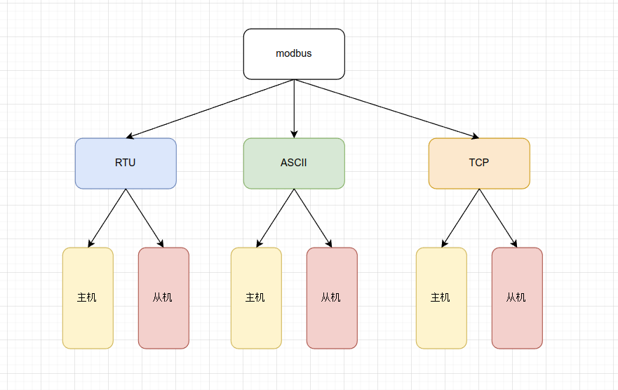
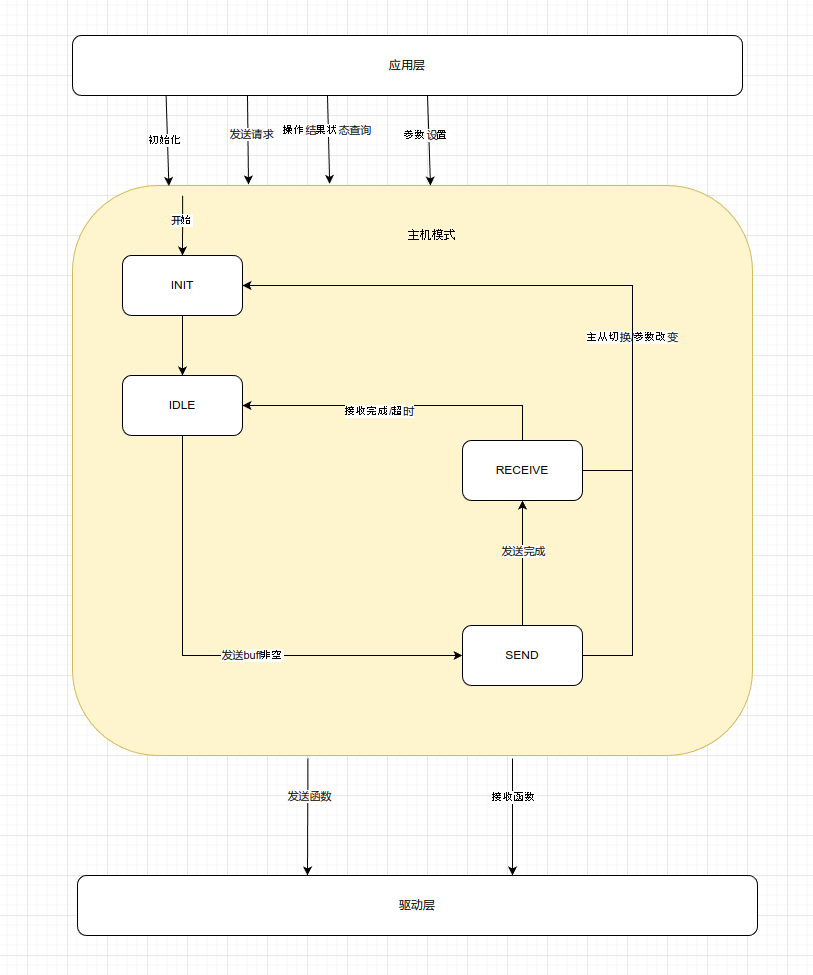
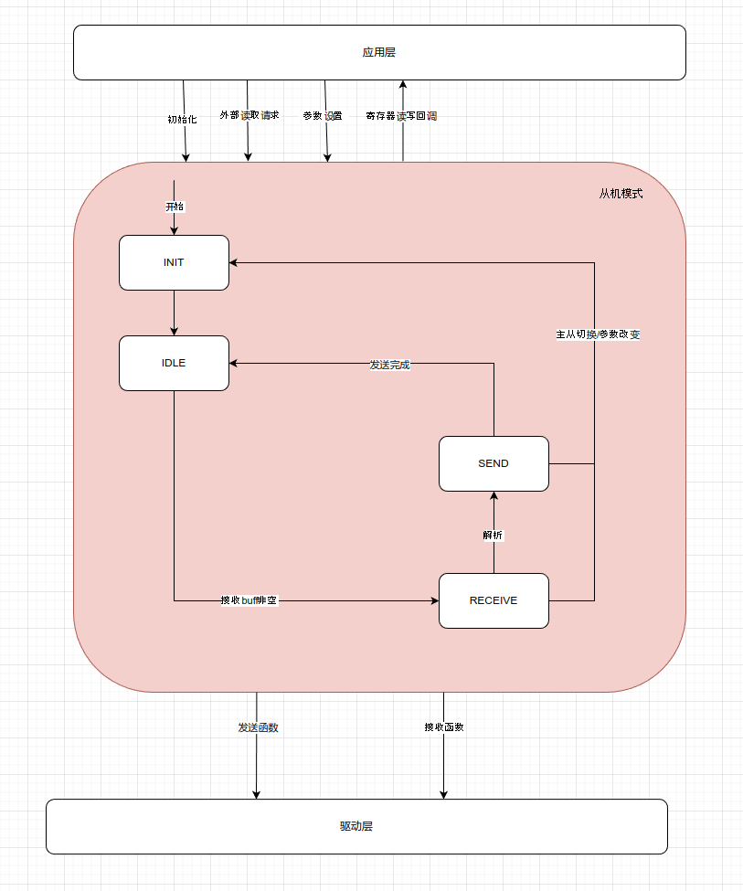

# modbus_module 设计概要

## 1. 代码结构

### 1.1 源码结构



### 1.2 主机模式



### 1.3 从机模式



## 2. 数据类型

```
typedef struct Modebus_RTU_Fun_Table
{
    uint8_t fcode;
    int8_t (*request)(stModbus_RTU_Handler *handler, stModbus_RTU_Sender *sender);
    int8_t (*slave_parse)(stModbus_RTU_Handler *handler, uint8_t *buff, uint16_t len);
    int8_t (*master_parse)(stModbus_RTU_Handler *handler, uint8_t *buff, uint16_t len);

}stModebus_RTU_Fun_Table;

typedef struct Modbus_RTU_Handler
{
    uint8_t dev_addr;
    stModbus_RTU_State state, last_state;               // send/receive switch judge
    emModebus_RTU_Mode mode, last_mode;                 // slave/master switch judge
    uint32_t last_call_tick;
    uint8_t tx_buff[300];
    uint16_t tx_len;
    uint8_t rx_buff[300];
    uint16_t rx_len;
    uint16_t *master_parse_addr;                             // master parse address(master mode use only)
    uint32_t Master_Wait_Count;                              // master wait recv time count(master mode use only)
    uint32_t Master_Wait_Recv_Limt;                         // master wait recv limit(master mode use only)
    stModebus_RTU_Fun_Table *fun_table;                    // callback function table
    uint8_t fun_table_items;
    int8_t (*send)(uint8_t *buff, uint16_t len);                  
    int8_t (*recv)(uint8_t *buff, uint16_t *len);
    int8_t reg_map_id;                                          // reserve for select register map table
    int8_t (*read_input)(stModbus_RTU_InputReader *reader);
    int8_t (*read_hold)(stModbus_RTU_HoldReader *reader);
    int8_t (*write_hold)(stModbus_RTU_HoldWriter *writer);

}stModbus_RTU_Handler;


typedef struct Modbus_RTU_Handler_Attribute
{
    uint8_t dev_addr;
    emModebus_RTU_Mode mode;
    int8_t (*send)(uint8_t *buff, uint16_t len);                  
    int8_t (*recv)(uint8_t *buff, uint16_t *len);
    int8_t reg_map_id;                                          // reserve for select register map table
    int8_t (*read_input)(stModbus_RTU_InputReader *reader);
    int8_t (*read_hold)(stModbus_RTU_HoldReader *reader);
    int8_t (*write_hold)(stModbus_RTU_HoldWriter *writer);
    stModebus_RTU_Fun_Table *fun_table;                    // callback function table
    uint8_t fun_table_items;

}stModbus_RTU_Handler_Attr;


```

## 3. 接口设计

```
/**
 * @brief  modbus rtu init
 * @param  handler: modbus rtu handler
 * @param  bus: modbus rtu bus
 * @param  attr: modbus rtu handler attr
 * 
 * @return 0: success, -1: fail
 */
int8_t modbus_rtu_init(stModbus_RTU_Handler *handler, emModebus_RTU_Bus bus, stModbus_RTU_Handler_Attr *attr);

void modbus_rtu_run(stModbus_RTU_Handler *handler);

/**
 * @brief 读取寄存器
 * @param bus 总线编号
 * @param dev_addr 设备地址
 * @param reg_addr 寄存器地址
 * @param reg_num 寄存器数量
 * @param reg_data 寄存器数据地址
 * 
 * @return 0 成功，-1 失败
 */
int8_t modbus_rtu_read_hold(emModebus_RTU_Bus bus, uint8_t dev_addr, uint16_t reg_addr, uint16_t reg_num, uint16_t *reg_data);

/**
 * @brief 读取上次操作完成状态
 * @param bus 总线编号
 * 
 * @return 0 完成，1 未完成　-１失败
 */
int8_t modbus_rtu_opt_status(emModebus_RTU_Bus bus);


```

## 4. 移植/应用

### 4.1 回调接口

```

int8_t (*send)(uint8_t *buff, uint16_t len);                   // 驱动层读接口 
int8_t (*recv)(uint8_t *buff, uint16_t *len);                   //　驱动层写接口
int8_t reg_map_id;                                          // reserve for select register map table
int8_t (*read_input)(stModbus_RTU_InputReader *reader);         //　应用层读输入寄存器回调
int8_t (*read_hold)(stModbus_RTU_HoldReader *reader);           //　应用层读保持寄存器回调
int8_t (*write_hold)(stModbus_RTU_HoldWriter *writer);          //　应用层写保持寄存器回调

```

### 4.2 移植接口

```
uint32_t modbus_port_get_time_ms();

```


[自测文档](./doc/selftest.md)

[测试程序](./test/readme.md)
